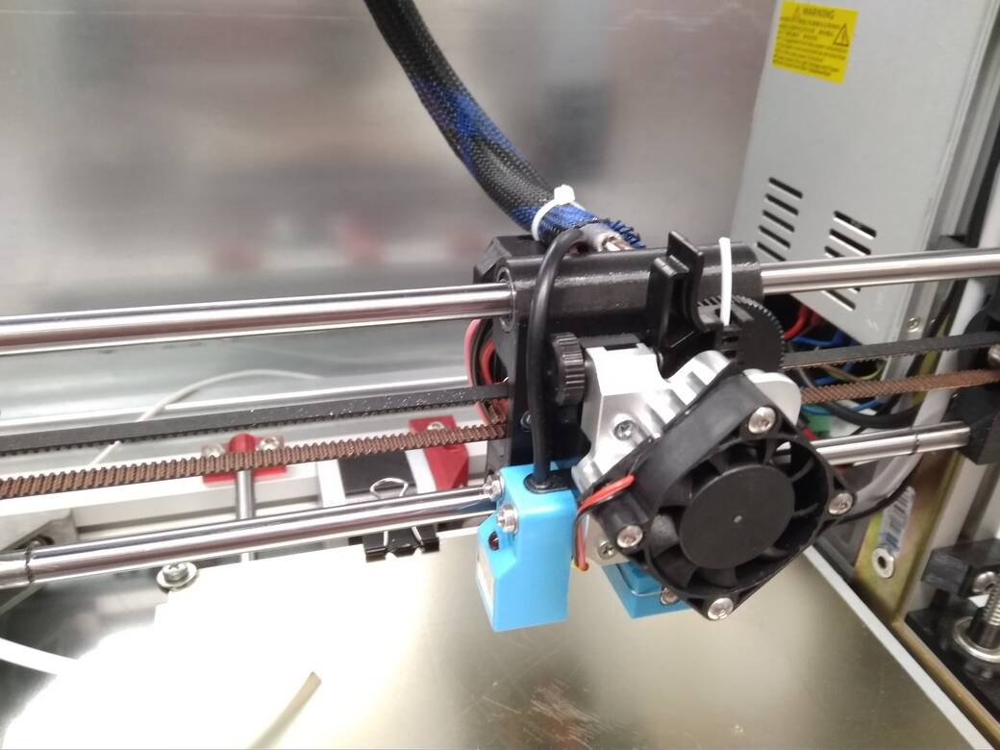
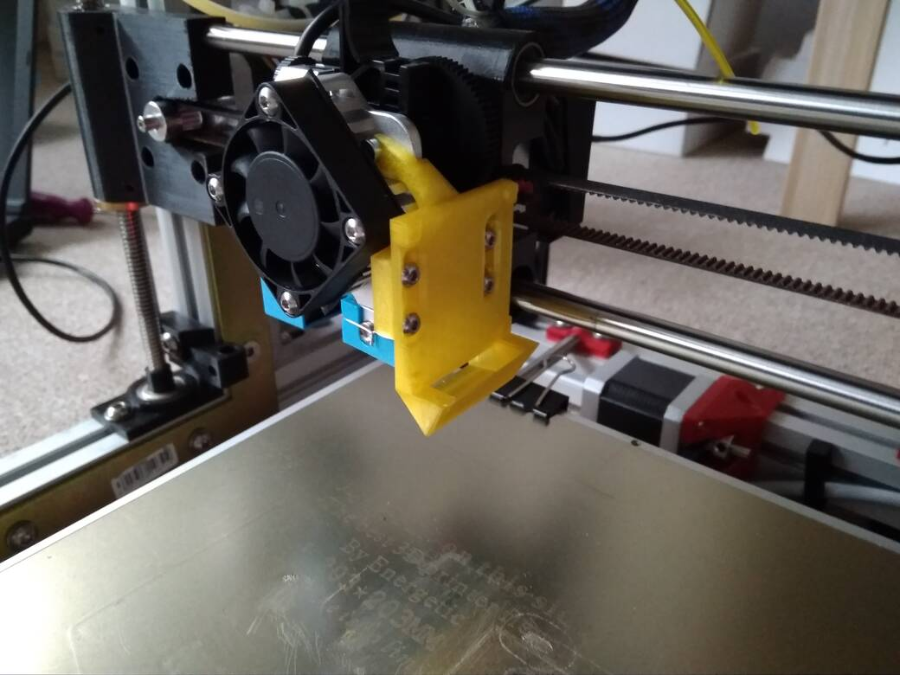
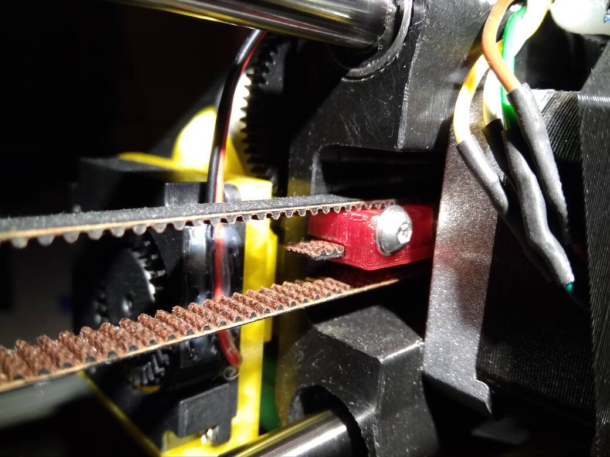

# The i2.5 ("Tiny") 3D printer

This was a learning project of mine on how to design and build a moving-bed
style 3D printer from scratch.

It started in ~2017 and grew in time and money spent from there, with me trying
various "new technologies" on the always-work-in-progress printer.

Things like

- sliding IGUS bushings instead of LM8UU bearings
- graphite-based self-lubricating brass bushings instead of LM8UU
- grease types on the Z-axis screw (dry graphite/teflon, calcium sulfonate,
  etc.)
- belt tensioning systems (and various types of timing belt fiber
  reinforcements)
- Z-axis screw couplers and their (in)accuracy
- bed probing (the design has left-over space for an X-gantry-mounted
  limit switch probe, the real printer ended up using an X-carriage
  inductive probe)
- inductive probe options and failure modes (~4 variants, sensors randomly
  failing due to 60C heat from the bed)
- magnetic beds and their limitations (tried 2-3 variants, some DIY,
  some purchased)
  - ended up using bed clamps as discrete magnets (glued to underside)
    were never strong enough to prevent the steel sheet from moving
  - sourcing spring steel sheets was also near-impossible in 2019
- heated bed issues (tried PCB, which flexed too much, tried fixing
  aluminium heatbed with broken corners, reliability issues, etc.)
  - also several variations on bed springs (stiffness, types, ended up
    with silicone-based springs)
- electronics
  - started as 8-bit, two different boards, using custom wiring
    for TMC2130 back when it was bleeding-edge and only Prusa had it
  - added an 8x8 red LED matrix to show gcode command queue
  - developed custom Blue Pill based stack for a 32bit cut-down Marlin 2.0
  - switched to a stock imported 32bit board later on
- extruder was originally a custom design loosely based on Greg's Wade's
  geared extruder using E3D V6, then re-worked to use E3D Titan Aero heatsink,
  then abandoned for a stock E3D Titan Aero extruder
  - with a custom-modified NEMA17 motor to use a longer shaft, so it can be
    mounted through the X-carriage, distributing front/back weight

Ultimately, the scope and cost of the project ended up being about 10x of what
it was originally meant to be, mainly thanks to unreliable, out-of-spec and
otherwise broken parts from Ebay and Aliexpress.  
(Bearings binding, bushings with wrong hole tolerances, electronics randomly
failing, IC chips like CH340 randomly locking up, toothed gears for driving
filament being made of soft metal, GT2 pulleys with malformed teeth, etc., etc.)

This repository therefore serves mainly as a source of spare parts for the one
printer that was ever built.

Please don't build another one, there are many better options these days.  
It's not 2017 anymore.

---

---

